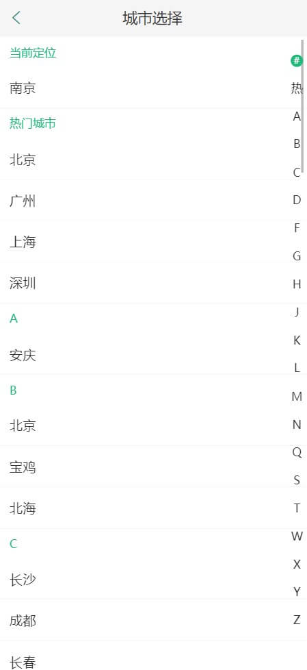

 :star:  :star:  :star:  :star:  :star: :star:  :star:  :star:  

### 项目推荐


仓库地址：[https://gitee.com/jerry306/find-houses](https://gitee.com/jerry306/find-houses)


### ---------------------------------------------


### 找房源v1.0

#### 项目介绍
找房源（移动web端）项目是基于 React 开发的移动端在线项目，采用模块化、工程化的设计思想，实现类似贝壳等APP的功能，解决用户寻找房源的需求。


#### 技术栈
React核心库、百度地图API、create-react-app、axios、antd-mobile、react-virtualized、formik+yup、react-spring、编程式路由等


#### 项目演示
- QQ交流：1976457550

##### 项目截图

 &nbsp; 

### 如何使用

将代码克隆到本地，在项目根目录下启动终端

安装依赖
```
yarn add
```

启动项目
```
yarn start
```


### 项目功能
##### 在线找房
通过百度地图查找房源；通过条件（如当前所在城市、交通、房租、房屋设施等）进 行查找
##### 城市选择
通过城市选择模块可以切换城市，也可以定位到当前城市，不同城市有不同房源

##### 登录模块
提供用户注册、登录、查看个人信息、修改个人信息等功能，同时，登录之后，用户可以收藏房源，并可以在“我的”页面查看已收藏房源具体信息
##### 房屋详情模块
该模块展示了房屋的具体信息，包括房屋租金、面积、配套设施、地理位置、房屋描述、特色、房主信息等，同时支持收藏（需登录后）与电话预约等功能
##### 房源发布
该模块实现房源发布功能，你可以出租自己的房屋，上传房屋的相关信息，并在已发布房源页面查看发布的房源（该模块需要先登录）


